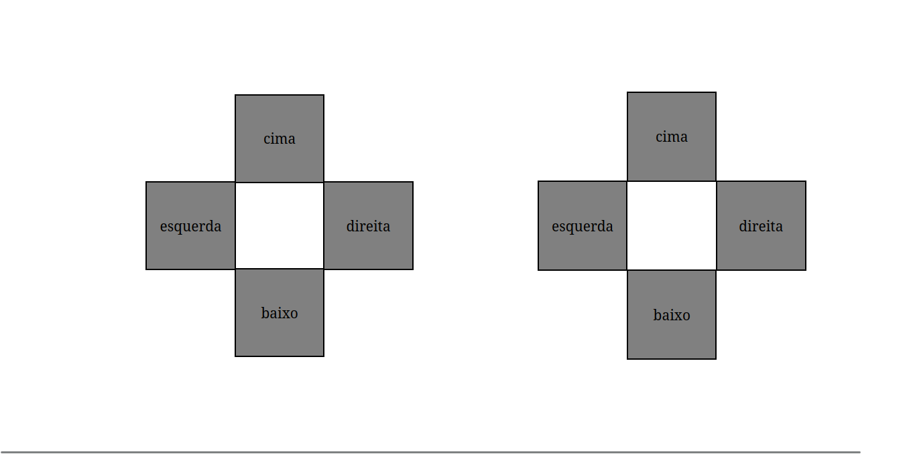

Lost all night thinking about this with a friend of how to do this same effect with flexbox, the problem is that the borders was always overlaying eachother. In the end i learned the difference of outline and border. And the use of negative margin.

Just use grid, is better, faster and save your mental health.
